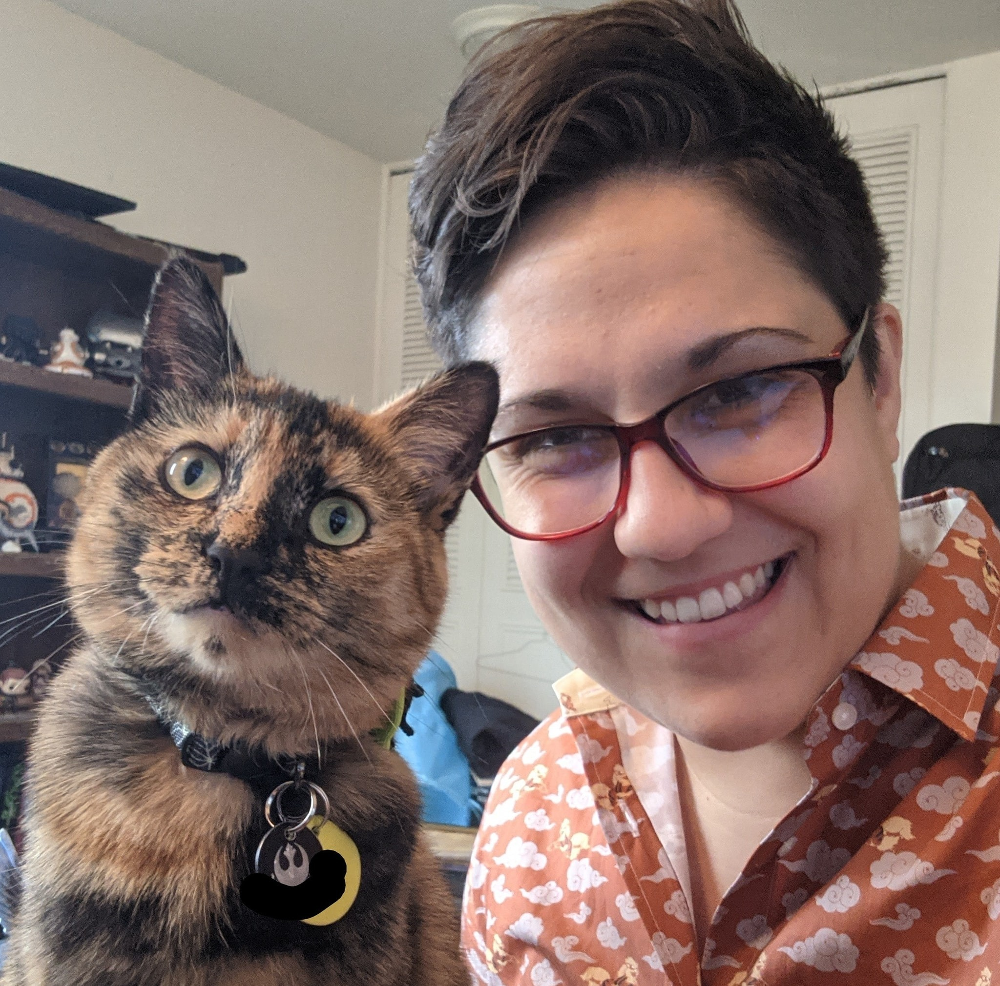
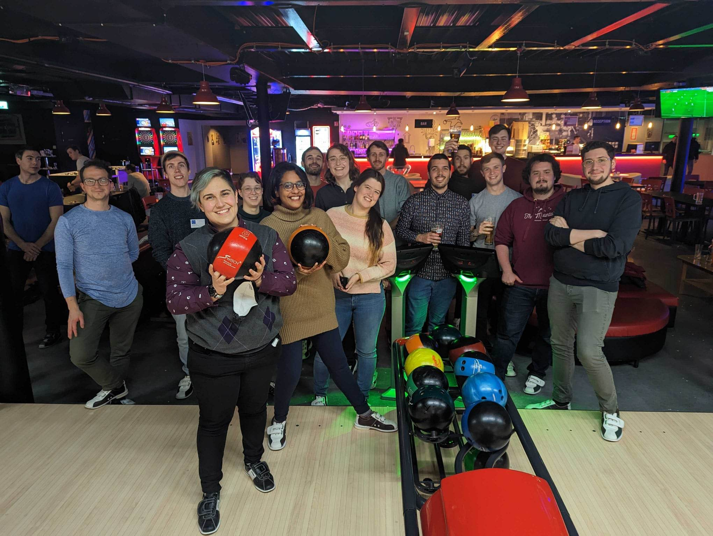
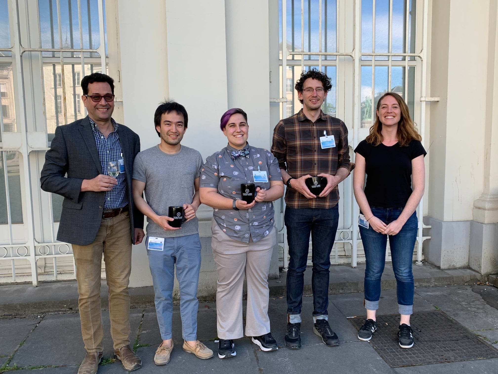
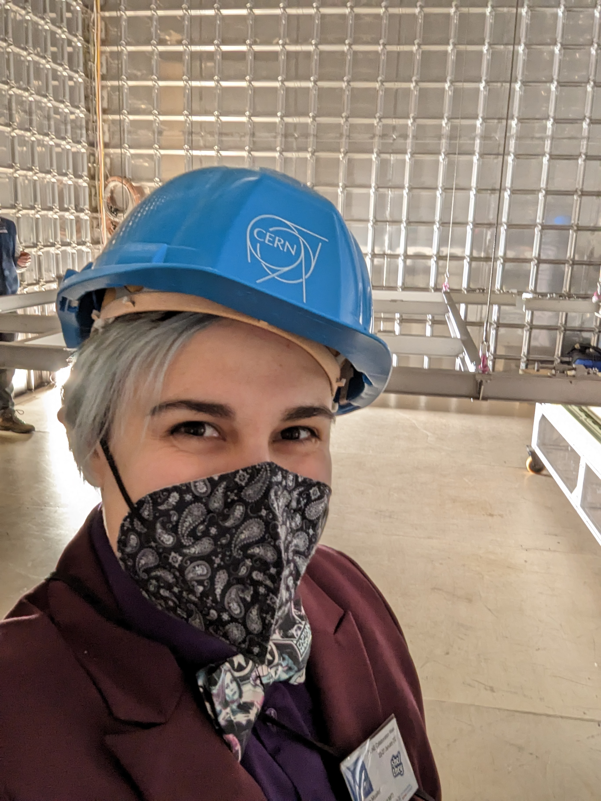

Dr. Jessie Micallef (she/they) is a postdoc fellow at IAIFI, where she uses machine learning to help uncover more information about neutrino particle properties. They are part of various neutrino experiments, including DUNE and MicroBooNE, and previously IceCube. Jessie enjoys mentoring students and empowering a diverse group of next generation researchers in STEM through chairing and running events to support women and gender minorities in physics, creating unique LGBTQ+ workshops and social media campaigns, and establishing new mentoring programs. Outside academia, she enjoys creative writing, practicing jiu jitsu, cuddling their cat Ahsoka, and attending comic cons and indie/rock concerts.

LinkedIn: https://www.linkedin.com/in/jlmicallef/

 

 <em>Jessie with DUNE collaborators bowling in Geneva, Switzerland<em>

 
## Current Roles

- Postdoc Fellow at the NSF AI Institute for AI and Fundamental Physics (www.iaifi.org)
- Member of IAIFI Community Building Committee
- Member of IAIFI Early Career and Equity Committee
- Member of DUNE collaboration
- Member of MicroBooNE collaboration

## Education
- Dual PhD in Physics and Computational Mathematics, Science, and Engineering from Michigan State University (2022)
- Masters in Physics from Michigan State University (2019)
- Bachelors in Science in Physics and Screen Arts and Cultures, minor in Chemistry, at the Residential College at University of Michigan (2016)

## Fellowships

- NSF AI Institute for Artificial Intelligence and Fundamental Physics Postdoctoral Fellowship: Sept 2022 - Aug 2025
- Association for Computing Machinery (ACM) Special Interest Group on High Performance Computing (SIGHPC) and Intel Computational Science Fellowship: July 2017 - July 2021
- National Science Foundation Graduate Research Fellowship: Sept 2017 - Sept 2022

/p>

 <em>Jessie standing with other IceCube collaborators holding the IceCube impact award<em>

## Recognition

- IceCube Collaboration Impact Award (IceCube Collaboration): May 2022
- Rising Stars in Experimental Particle Physics Symposium (University of Chicago): Sept 2021
- Best Lightning Talk (Neutrino Physics and Machine Learning Lightning Talks): July 2020
- Diversity Equity Inclusion Training Award (IceCube Collaboration): Jan 2020 
- Women in Computing Award (Microsoft Windows Insider Program): Oct 2019
- Outreach Award (Michigan State University’s Physics & Astronomy Department): May 2019
- William L. Williams Thesis Award	(University of Michigan): Apr 2016
- Outstanding Achievement in Physics Award (University of Michigan): May 2015
- Sigma Pi Sigma Physics Honor Society (University of Michigan): Inducted Feb 2015
- Best Research Presentation	(Conference for Undergrad Women in Physics, Univeristy of Michigan): Jan 2015
- 1000 Pitches Technology and Hardware Winner (University of Michigan): Dec 2011
- Provisional Patent (No. 61/409,855 ) for Radio Jammer Device: Filed 3 Nov 2010

 
 

 <em>Jessie inside one of the protoDUNE detectors at CERN<em>

  
## Publications

Member of large particle physics collaborations, author lists are alphabetical. Listing publications with direct contribution here, full list of publications available.
- J. Micallef for the IceCube Collaboration. Using Convolutional Neural Networks to Reconstruct Energy of GeV Scale IceCube Neutrinos. JINST 16.09 (2021) ,p. C09019.
- J. Micallef for the IceCube Collaboration. Reconstructing Neutrino Energy using CNNs for GeV Scale IceCube Events. PoS ICRC2021(2021) 1057.
- S. Yu for the IceCube Collaboration. Direction Reconstruction using a CNN for GeV-ScaleNeutrinos in IceCube. PoS ICRC2021 (2021) 1054.
- C. Hill for the IceCube Collaboration. Performance of the D-Egg optical sensor for the IceCube-Upgrade. PoS ICRC2021 (2021), 1042.
- R. Abbasi et al. “A Convolutional Neural Network based Cascade Recon-struction for the IceCube Neutrino Observatory.” In: (Jan. 2021). arXiv:2101.11589
- C. Adams, et al. White Paper on Neutrino Physics and Machine Learning, in-progress
- B. Clark, et al. IceCube and IceCube-Gen2 Machine Learning, Snowmass2021 Letter of Interest, Sept 2020.
- S. Su, et al incl J. Micallef. The Data Acquisition System of the KOTO Experiment and the RCE Platform technology upgrade. IEEE Transactions on Nuclear Science, PP(99):1–1, 2017.
- S. Su, et al incl J. Micallef. The Data Acquisition System of the KOTO Experiment and RPT Upgrade. In Proceedings, 20th IEEE-NPSS Real Time Conference (RT2016): Padua, Italy, June 5-10, 2016, 2016.
- M. Tecchio, et al incl J. Micallef. The upgrade for the data acquisition system of the KOTO detector. Nucl. Instrum. Meth., A824:365–366, 2016.
- S. Su, et al incl J. Micallef. The data acquisition system for the KOTO detector. PoS, TIPP2014:203, 2014.
