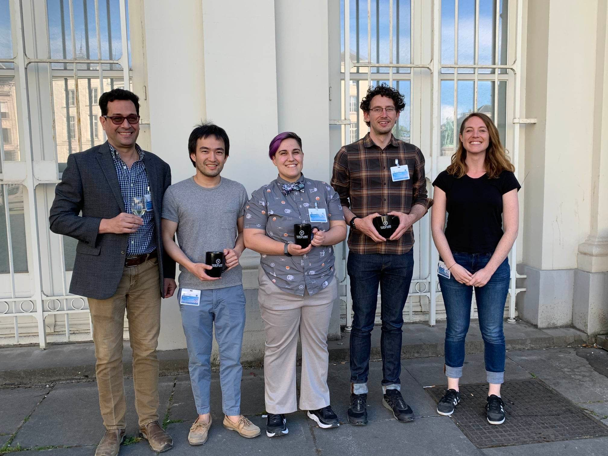
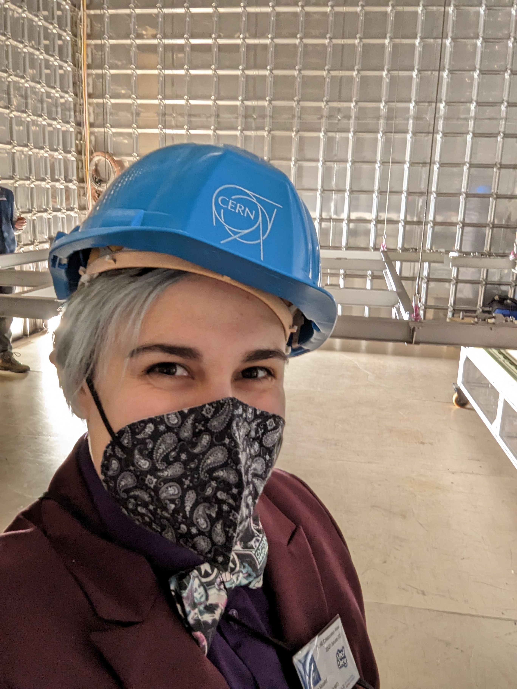

Dr. Jessie Micallef (they/them) is dedicated to adapting machine learning tools to further learning and research. They aim to contribute to a high impact output with products that directly support learners, educators, and researchers. They bring a unique perspective informed by experiences in mentoring, teaching, creating programs that bolster the scientific community, and engaging with science education research on the latest successful pedagogy. 

Jessie with a graphic they commissioned explaining standard model of particle physics       
:--------------------------------------------:

Dr. Jessie is currently a postdoc scholar at Tufts University, where they use machine learning to help uncover more information about neutrino particle properties. They live and work at Fermilab, which is the site for the two neutrino experiments that they are currently part of: [DUNE and MicroBooNE](projects.md). Jessie enjoys mentoring students and empowering a diverse group of next generation researchers in STEM through chairing and running [events to support women and gender minorities in physics](outreach.md), creating unique LGBTQ+ workshops and [social media campaigns](poas.md), and establishing new [networking programs](buddysyst.md). Outside academia, they enjoy creative writing, practicing jiu jitsu, cuddling their cat Ahsoka, and attending comic cons and cosplaying.

LinkedIn: https://www.linkedin.com/in/jlmicallef/

Jessie getting the first of 3 Impact Award from 3 sepearate experiments
:--------------------------------------------:

## Awards and Honors

- Best Poster Award at Neutrino Phyics and Machine Learning: October 2025
- NuFact2025 Best Poster Award (NuFact Confernece): September 2025
- MicroBooNE **Impact Award** for Data Release Validation (MicroBooNE Collaboration): May 2025
- DUNE **Impact Award** for the 2x2 Core Operations Team (DUNE Collaboration): January 2025
- Best Plot for MicroBooNE Analysis Workshop (MicroBooNE Physics Conveeners): November 2022
- IceCube Collaboration **Impact Award** (IceCube Collaboration): May 2022
- Rising Stars in Experimental Particle Physics Symposium (University of Chicago): Sept 2021
- Best Lightning Talk (Neutrino Physics and Machine Learning Lightning Talks): July 2020
- Diversity Equity Inclusion Training Award (IceCube Collaboration): Jan 2020 
- Women in Computing Award (Microsoft Windows Insider Program): Oct 2019
- Outreach Award (Michigan State University’s Physics & Astronomy Department): May 2019
- William L. Williams Thesis Award	(University of Michigan): Apr 2016
- Outstanding Achievement in Physics Award (University of Michigan): May 2015
- Sigma Pi Sigma Physics Honor Society (University of Michigan): Inducted Feb 2015
- Best Research Presentation	(Conference for Undergrad Women in Physics, Univeristy of Michigan): Jan 2015
- 1000 Pitches Technology and Hardware Winner (University of Michigan): Dec 2011
- Provisional Patent (No. 61/409,855 ) for Radio Jammer Device: Filed 3 Nov 2010

## Education
- Dual PhD in Physics and Computational Mathematics, Science, and Engineering from Michigan State University (2022)
- Masters in Physics from Michigan State University (2019)
- Bachelors in Science in Physics and Screen Arts and Cultures, minor in Chemistry, at the Residential College at University of Michigan (2016)

## Fellowships and Funding

- University Research Alliance Visting Scholars Porgram at Fermilab National Lab: March 2023 - June 2024
- NSF AI Institute for Artificial Intelligence and Fundamental Physics Postdoctoral Fellowship: Sept 2022 - Aug 2025
- National Science Foundation Graduate Research Fellowship: Sept 2017 - Sept 2022
- Association for Computing Machinery (ACM) Special Interest Group on High Performance Computing (SIGHPC) and Intel Computational Science Fellowship: July 2017 - July 2021
- Otto F. and Jenny H. Krauss Charitable Foundation Distinguished Fellowship at Michgan State University: Summer 2016

## Current Roles

- Postdoc Scholar in the Physics and Astronomy Department at Tufts University
- Convener of Oscillations and Low Energy Excess group on MicroBooNE
- Coordinator of DUNE Buddy System
- Member of American Women in Science, American Physical Society
- Member of DUNE collaboration
- Member of MicroBooNE collaboration

Jessie inside a particle physics detector
:-------------------------:

