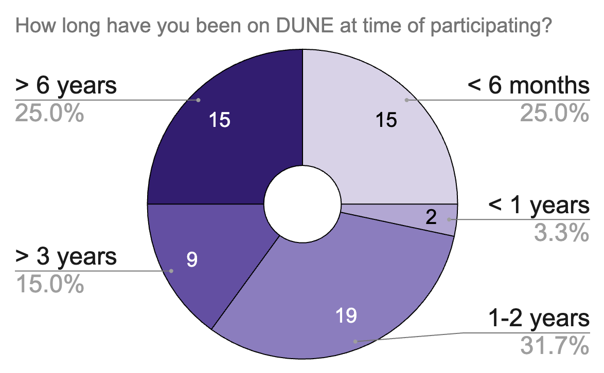
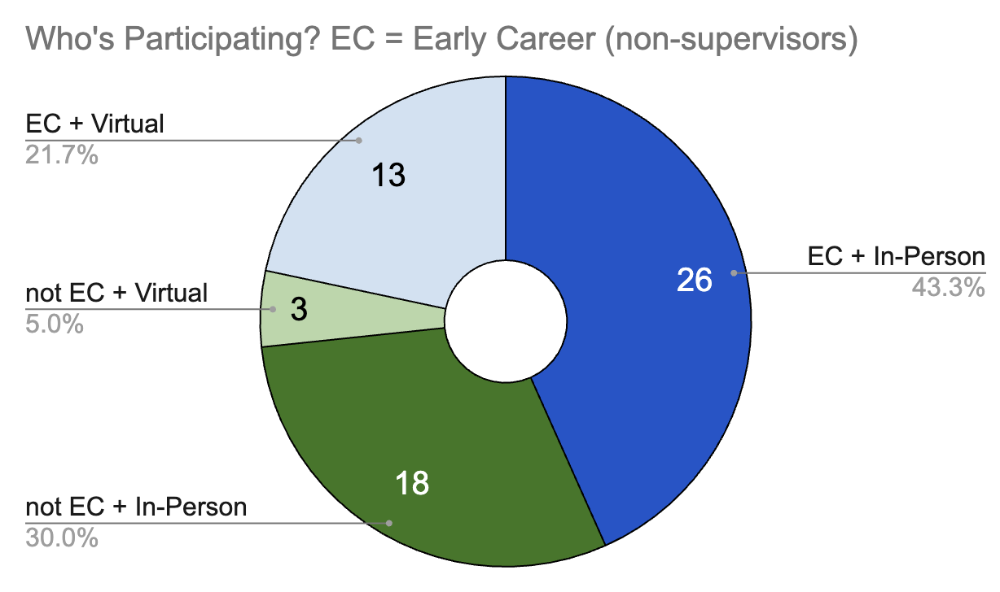

The Buddy System Program is a networking program that was developed for large conference or collaboration meetings. It has been applied to the DUNE experiment at their collaboration meeitngs, which hosts 300-500 attendees. The program is optional and aims to match attendees who opt-in with another participant, based on their preferences communitcated through a survey. 

The goal is to create one-on-one networking matches for participants who...
- Are first-time attendees at the meetings
- (and/or) Are attending virtually, to still make at least one connection during the meeting week 
- (and/or) Seasoned attendees who ant to make connections outside their usual circle

## About the Matching ##

## Adopt the Buddy System for your Meeting! ##

People are more than welcome to use the Buddy System Program for their own conference or meeting! There are examples of documentations available in the [Buddy System Google Drive](https://drive.google.com/drive/folders/1hLMuapic1MDwuqxRQzwDhMqqEdvfirLy?usp=drive_link)!

- Example of survey to faciliate matching
- Example of post-program survey to gather feedback
- Tips and tricks
- How to automate emailing in google sheets

## Best Poster at NuFact 2025 ##

