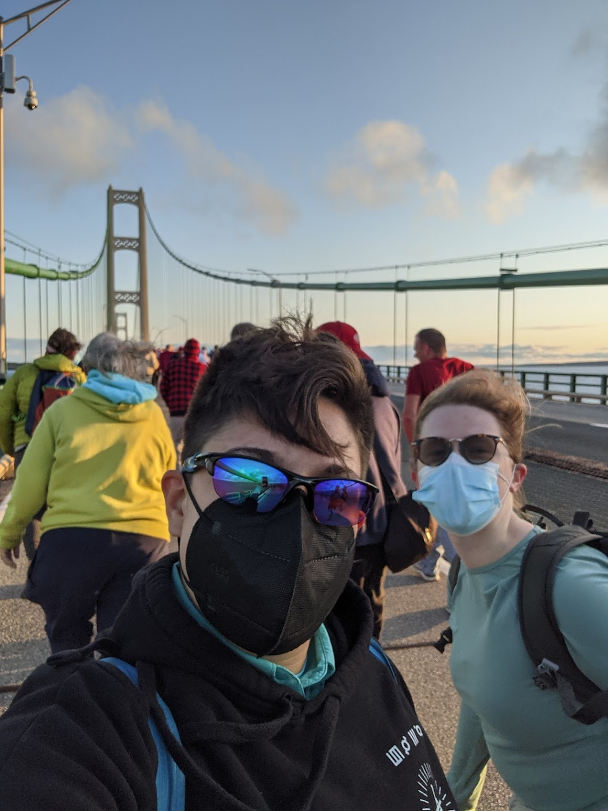
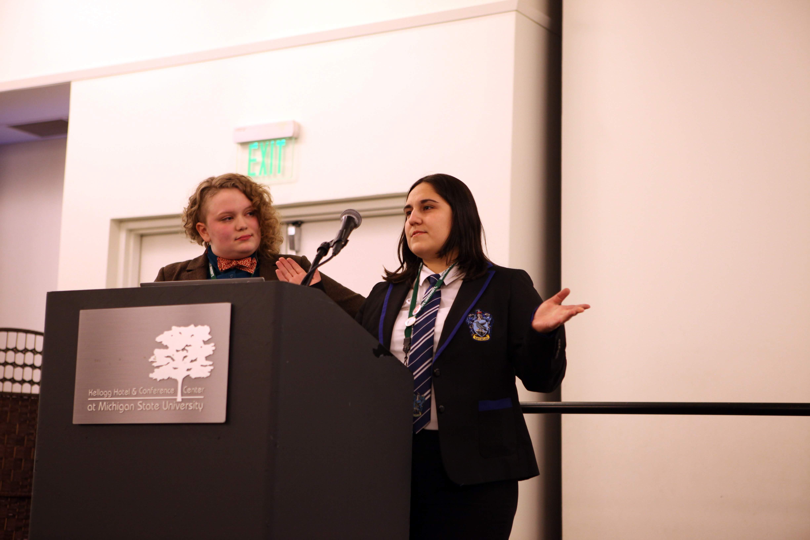

    <em>CUWiP 2019 at Michigan State University, where Jessie was co-Chair.</em>

## Conference for Undergraduate Women in Physics (CUWIP)
* Co-Chair of Conference
  - When: January 2018 - January 2019
  - Where: Michigan State University (East Lansing, Michigan)
  - What: Organized and delegated conference to support, inspire, and educate 180 undergraduate women in physics. Created a program that hosted content from 100+ speakers and volunteers with workshops focused on physics research, personal and professional development, and career path options for women in physics.
* Organizing Committees
  - When: September 2014 - January 2015,  September 2020
  - Where: Virtual (2020), University of Michigan (2014-2015)
  - What: Served on agenda committee to advise American Physical Society’s first virtual CUWiP program (2020). Contribute to Local Organizing Committee for 2015 CUWiP by coordinating volunteers for photography and videography, merchandise and branding for awards and giveaways, and attending regular planning meetings. 
* Panelist
  - When: January 2018, January 2022, January 2023
  - Where: Virtual (2023), Virtual (2022), Toledo University (2018)
  - What: Share knowledge and experiences in physics with undergraduate women on panel and at conference events.

    <em>Jessie and WaMPS mentee Laura, walking the Mackinac Bridge together.</em>

## Additional Diversity and Outreach
* IAIFI Early Career and Equity Committee
  - When: February 2022 - present
  - Where: NSF AI Institute for Artificial Intelligence and Fundamental Interactions
  - What: Meet monthly to discuss improvements to provide equitable environment at IAIFI and support early career scientists by providing recommendation. Spearheaded conscious effect to integrate affinity group celebrations (history months, STEM+ days) into our event planning to increase awareness of minorities to support and make IAIFI events more accessible
* IAIFI Community Building Committee
  - When: September 2022 - present
  - Where: NSF AI Institute for Artificial Intelligence and Fundamental Interactions
  - What: Organize various events with awareness to integrate IAIFI members from all career & work-life backgrounds. Coordinate new regular events, including “games and crafts” nights and weekly brown bag lunches. Contributed to proposal accepted by MIT Quality of Life program to fund a workshop on the discussion of creative Artificial Intelligence methods (like ChatGPT) and the ethics behind them
* Portrait of a Scientist Diversity Project
  - When: August 2020 - present
  - Where: Virtual and In Person at Various Conferences
  - What: Deconstruct stereotypes about what a scientist looks like and how they act. Collect community submissions completing the phrase "I am a scientist and I also..." Designed photo collage and video montage, available at https://jessimic.github.io/tech-portfolio/docs/poas
* Diversity Task Force
  - When: February 2021 - August 2022
  - Where: IceCube Collaboration (virtual)
  - What: Organized events for collaboration’s  Women and Gender Minorities Networking and LGBTQ+STEM day. Biweekly meetings to discuss diversity initiatives such as mentoring, climate surveys, and seminar events.
* American Physical Society Inclusion, Diversity, and Equity Alliance
  - When: September 2020 - May 2021
  - Where: Michigan State University (virtual)
  - What: Contribute to inclusion and diversity discussions at local universities and meetings with nearby institutes. Participated in American Physical Society (APS) workshop on inclusion, diversity and equity.
* Board for Women and Minorities in Physical Sciences (WaMPS)
  - When: September 2016 - April 2020
  - Where: Michigan State University (East Lansing, Michigan)
  - What: Led initiatives for careers in physics seminar, creating undergraduate mentoring program, restructuring the physics department’s graduate visit weekend to be more inclusive.. Support inclusive initiatives and improve the physics department environment for women and minorities. President (May 2018 - April 2019), Mentoring Co-Chair (May 2019 - April 2020), Vice President (May 2017 - April 2018), and First Year Liaison (September 2016 - May 2017).
* WaMPS Mentor
  - When: September 2017 - May 2020
  - Where: Michigan State University (East Lansing, Michigan)
  - What: Regularly connected with mentee online and in person to support them and answer their question. Mentored three graduate students and one Research Experience for Undergraduates summer student.
* Committee Chair and Volunteer for Society of Women in Physics
  - When: September 2013 – April 2016
  - Where: University of Michigan (Ann Arbor, Michigan)
  - What: Committee Chair for Slauson Middle School “Demo Day,” volunteer for Girl Scouts Day and Capstone. Organized community outreach events to spark young students’ interest in physics.Created “Update from Alumni” video for the society’s 10th anniversary.

## Teaching
* SL@MS Programming Workshop & Activities
  - When: August 2018, August 2019, August 2021
  - Where: Michigan State University (East Lansing, Michigan) and virtual (in 2021)
  - What: Facilitated interactive science projects and coding workshops for under-resourced middle school students.
* Neutrinos in Your Home with ICEcuBEAR
  - When: February 2021 - April 2021
  - Where: Michigan State University virtual Science Festival
  - What: Developed interactive presentation using the IceCube Augmented Reality phone app (ICEcuBEAR).
* Python for Physicists Programming Workshop
  - When: January 2019, February 2020
  - Where: Michigan State University (East Lansing, Michigan)
  - What: Created and adapted jupyter notebook introduction to programming using Python, numpy, and matplotlib. Guided undergraduate students through notebooks at WaMPS mentoring event, also used at CUWiP 2019.
* Assistant Head Teaching Assistant for Physics DATA Labs
  - When: Spring 2018
  - Where: Michigan State University Physics and Astronomy Department (East Lansing, Michigan)
  - What: Lead weekly teaching assistant meetings, answered questions, and coordinated grading for 27 sections. Rewrote an entire lab session on plotting, adopted and taught by all Physics 251 lab sections in Spring 2018.
* Graduate Teaching Assistant for Physics 252 & 251 DATA Labs
  - When: Fall 2016, 2017 & Spring 2017, 2018
  - Where: Michigan State University Physics and Astronomy Department (East Lansing, Michigan)
  - What: Taught 20 students in introductory physics labs with mechanics, electromagnetics, and optics experiments. Provided written feedback and grades to focus improvement on scientific skills relevant to all STEM fields.
