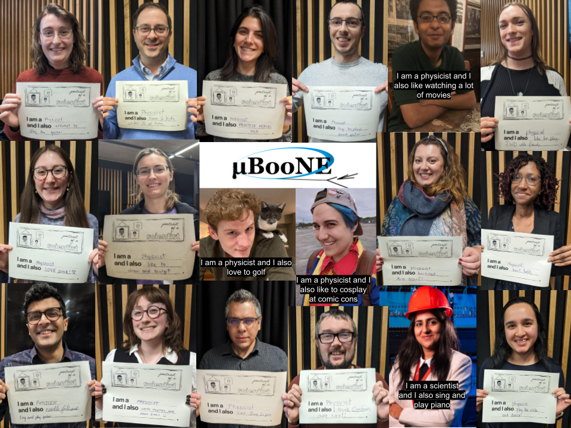

Portrait of a Scientist aims to deconstruct stereotypes about what a scientist looks and acts like and demystify who can be a scientist. It relies on community submitted videos and images that complete the phrase "I am a scientist and I also..." Please help us show that anyone can be a scientist!

## Contribute ##

Note that these contributions will be shared on social media and that that each submission will be included at the project manager's discretion. Feel free to check us out on [Facebook](https://www.facebook.com/PortraitOfAScientist)!

### Personal Contribution ###

There are many ways to contribute, with the theme of finishing the phrase "I am a _______ [STEM position or field of study] and I also __________". [Submit here](https://forms.gle/Ze1eJA6T8jBqQtkB9)!

1. Submit a photo of yourself (can be old or new), include your phrase in the comments box of the submission form or write it on your picture yourself!
2. Submit a photo of yourself holding your phrase on a sign--you can also print our templates!(see below)
3. Submit a video of yourself saying the phrase (props welcome but not necessary).

The phrase is open ended, so you can feel free to talk about a hobby, place of origin, cultural identity, religion, race, gender, sexuality, other roles (ie. mother, father, caretaker, etc.), educational background, anything else you want to share! You can also submit one or many!

### Run the Project Yourself! ###

Want to gather responses at your own institution/collaboration/conference? Save the templates below and have them available for people to complete! I would love to see the final product, and share on this website if you have everyone's permission. If you want help putting together the pictures into a collage, share a folder with the pictures and I will edit them together for distribution! Email to portraitscientist@gmail.com.

### Templates ###
Links to download the [color](./assets/Portrait-of-a-Scientist_Template_Color.pdf) and [black and white](./assets/Portrait-of-a-Scientist_Template_BW.pdf) template signs of "I am blank and I also blank". Also download a [sign-up sheet](./assets/POAS_SignUp_Sheets.pdf), to get permission from everyone to post their picture online.

## Picture Collages ##

### Download as pdf ##

[MicroBooNE Collaboration Meeting January 2024](.assets/uBooNE_Portrait_of_Scientist.pdf):

[Penn State Physics Department Visit November 2023](.assets/PennState_POAS.pdf):

[DUNE Collaboration Meeting May 2023](.assets/POAS_DUNE_4x3_FINAL.pdf):

[Conference February 2023](.assets/PortraitOfAScientist_LakeLouise2023-compressed.pdf):

## Video Collages ## 

This project has a channel on [YouTube](https://www.youtube.com/@portraitofascientist3539) where the portrait video collages are shared! Subscribe if you want updates when new videos are posted!

Video collage from winter conference (Feb 2023). Click image to play on youtube:    

Video collage from at-home submissions during the pandemic (Oct 2020). Click image to play on youtube:    

## Subscribe ##

Want to stay up to date about new project postings and calls for contributions? [Subscribe!](http://eepurl.com/imNhbo)

