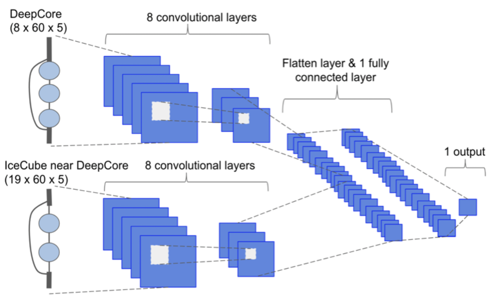

## My Scientific Motivation (with jargon)

Particle physics uses the smallest, most fundamental building blocks to answer the universe’s biggest questions. My physics research focuses on answering these questions, specifically expanding our understanding of neutrino oscillation and CP violation, which can lead to answers about matter/antimatter asymmetry and Beyond Standard Model (BSM) physics. While the Standard Model of particle physics lays the foundation for fundamental interactions, several discrepancies in the neutrino sector, such as the existence of neutrino masses and flavor mixing, leave open critical questions. Thus, neutrinos provide a rich opportunity to explore the Standard Model to probe many of the aforementioned physics questions. 

Machine Learning (ML) methods provide fast, stable solutions for dealing with large datasets, which is vital to next generation neutrino physics experiments. Developing ML methods for particle physics requires quickly identifying the latest AI advances and synergizing the key components into user-friendly, reliable code. These methods need to be tuned specifically to handle noisy particle physics data and tested to ensure robustness against biases in the model and data. Thus, interdisciplinary cooperation between ML and physics is key to innovative future research, particularly in particle physics.

## Neutrinos (the basics)

Neutrinos are fundamental particles, meaning they cannot be broken down further, that are the source of much interest in particle physics. These nearly massless, extremely fast, and difficult to detect particles may hold the key to understand multiple questions still open in the Standard Model. 

Poster Source: https://neutrinos.fnal.gov/whats-a-neutrino/

## Neural Networks

Neural Networks are machine learning tools with multifaceted methods. 

Github with ML Reco for LArTPCs: https://github.com/DeepLearnPhysics/lartpc_mlreco3d.

## DUNE - Deep Underground Neutrino Experiment

[DUNE](https://www.dunescience.org/) aims to make precision measurements of neutrino properties to help complete a clearer picture of the foundational laws governing the visible matter in our universe. To accomplish this goal, DUNE is employing novel detector techniques that require prototype testing, such as a modularized detector of Liquid Argon Time Projection Chambers (LArTPCs). The 2x2 prototype LArTPC detector is comprised of the first 4 modules of DUNE’s Near Detector (ND) and will be taking data this summer using Fermilab’s Neutrinos at the Main Injector (NuMI) beamline.

My work is expanding the Machine Learning reconstruction package in place for the 2x2 prototype LArTPC to integrate input from outer detectors that surround the LArTPC to inform the reconstruction. This requires a deep understanding of the existing machine learning reconstruction methods along with the multifunctional detectors.

## MicroBooNE

[MicroBooNE](https://microboone.fnal.gov/) is a large, LArTPC detector situated at the Boosted Neutrino Beamline at Fermilab. It has finished taking data, and the full dataset is still under analysis by physicist collaborators. It was placed near the MiniBooNE(https://www.fnal.gov/pub/science/experiments/intensity/miniboone.html) detector to help better understand the electron-like neutrino excess that they measured. 

My work is exploring a first approximation of a sensitivity for a 3+1 oscillation analysis using three detectors (MicroBooNE, ICARUS, and SBND) and two beamlines (BNB and NuMI) at Fermilab.

## Particle Physics and Neutrinos on IceCube (2016 - 2023)

The [IceCube Neutrino Observatory](https://icecube.wisc.edu/), located at the South Pole, instruments a cubic kilometer of ice with photosensors to detector neutrino interactions. It detects both astrophysical and atmospheric neutrinos, the latter which 

My work was lead a study to measure two of the neutrino oscillation parameters using IceCube’s large atmospheric neutrino sample. This study was limited by the computational burden of existing reconstruction methods. To overcome this, I developed convolutional neural networks (CNNs) to apply to multipurpose neutrino regression reconstructions and event classifications on 10 GeV-scale IceCube neutrinos, optimizing the network until it had a comparable resolution and runs 10^4 times faster than the current maximum likelihood reconstruction method. We applied these CNNs to IceCube’s atmospheric neutrino sample to constrain the oscillation parameters for muon neutrino disappearance, expecting to have a comparable sensitivity of the neutrino mixing parameters to accelerator neutrino experiments. IceCube probes these parameters over multiple baselines and energies, providing a complementary view of neutrino oscillation to dedicated accelerator neutrino programs and adding to our holistic understanding of neutrinos’ behavior and Standard Model deviations.

CNN Reconstruction Proceedings: https://pos.sissa.it/395/1053/pdf, https://iopscience.iop.org/article/10.1088/1748-0221/16/09/C09019/pdf

Beyond my extensive ML experience, I have contributed to multiple particle physics analyses, including those specific to neutrino oscillation; I have applied computational methods to simulate hardware, apply improvements, and analyze detector testing; and I have contributed directly to detector component testing. I have explored the effect of non-standard neutrino interactions (NSI) due to matter effects on IceCube, complimenting neutrino oscillation analyses. I employed computational solutions through using Markov Chain Monte Carlos as an alternative to traditional minimizers when our analysis could not converge with the additional NSI parameters. During my undergraduate, I contributed to hardware and software projects working on the high energy physics experiment KOTO, which aims to measure the branching ratio of a rare neutral kaon decay and explore CP violation.
