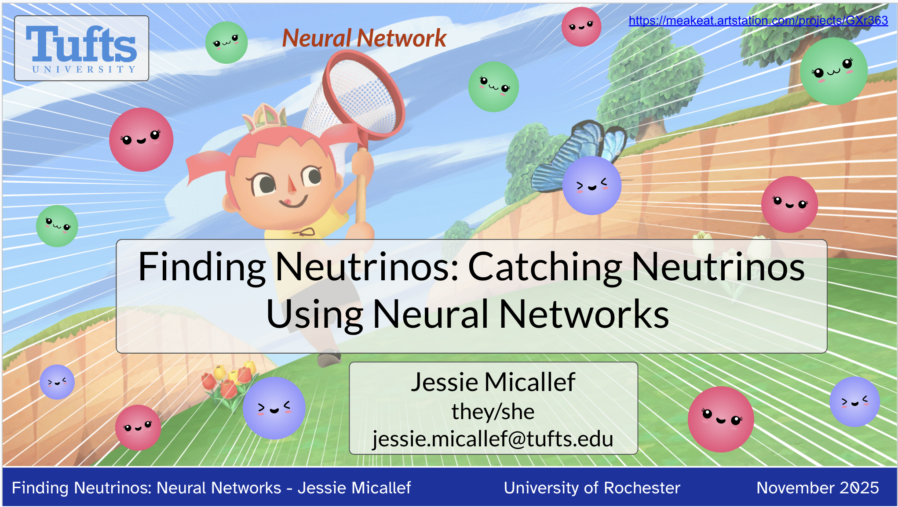
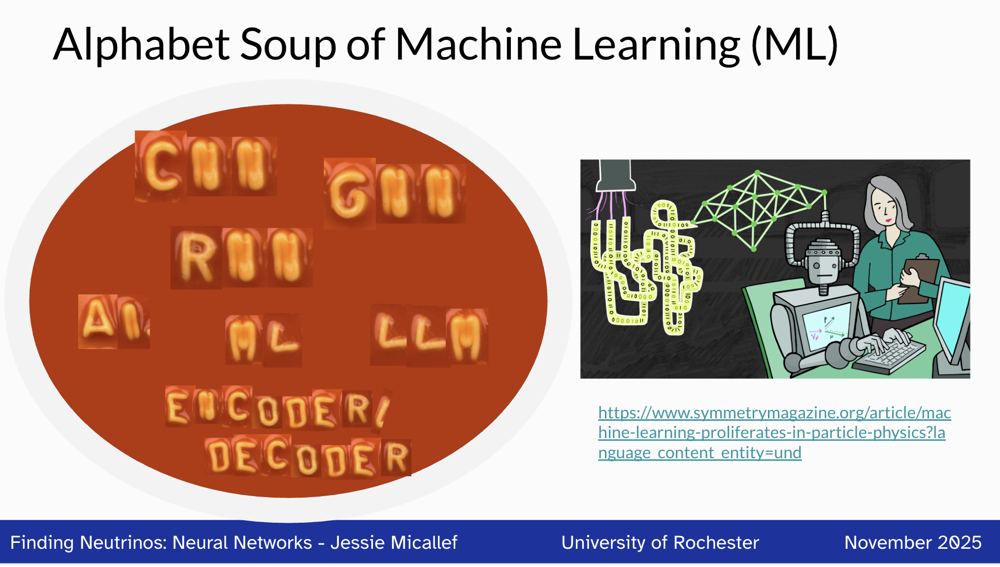
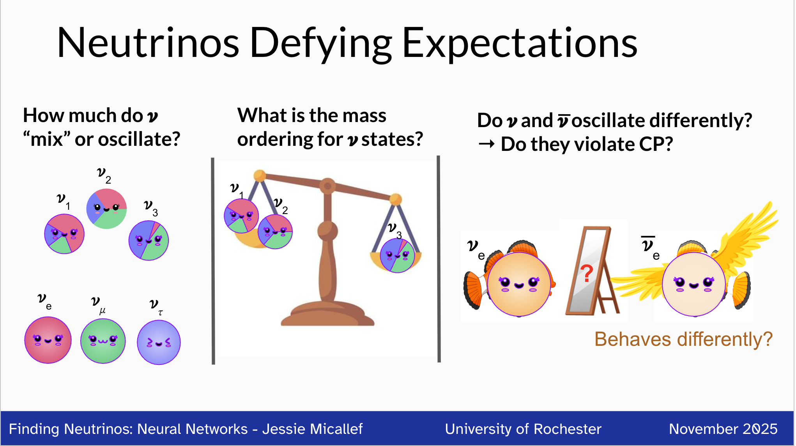
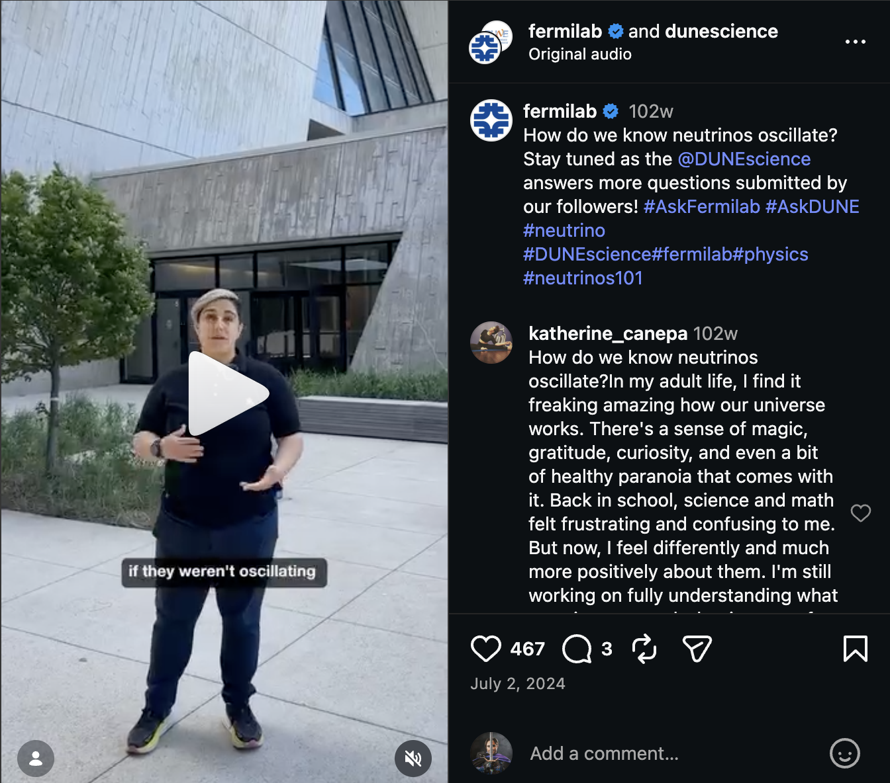
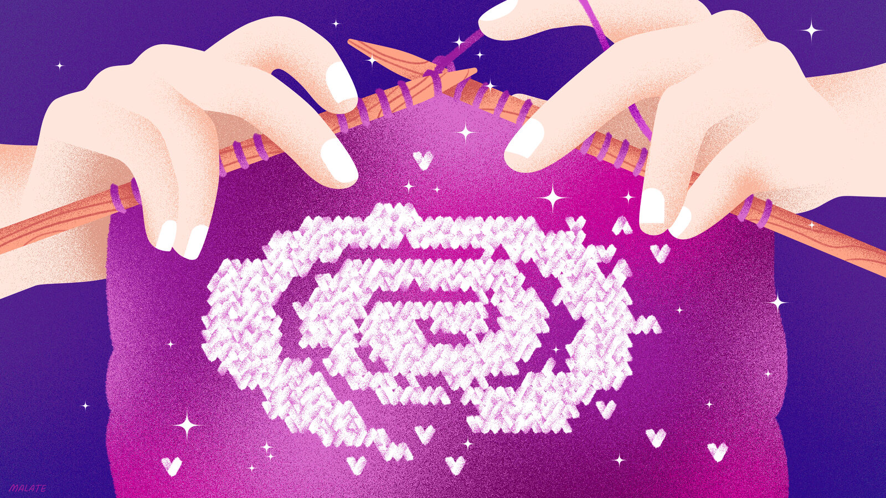
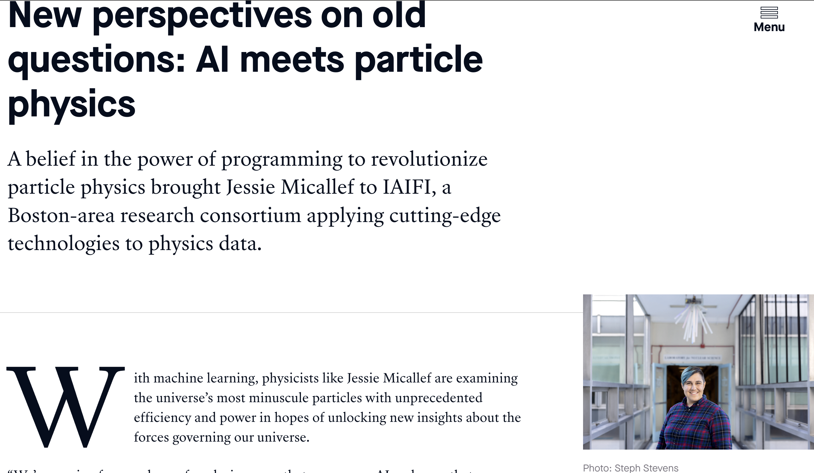
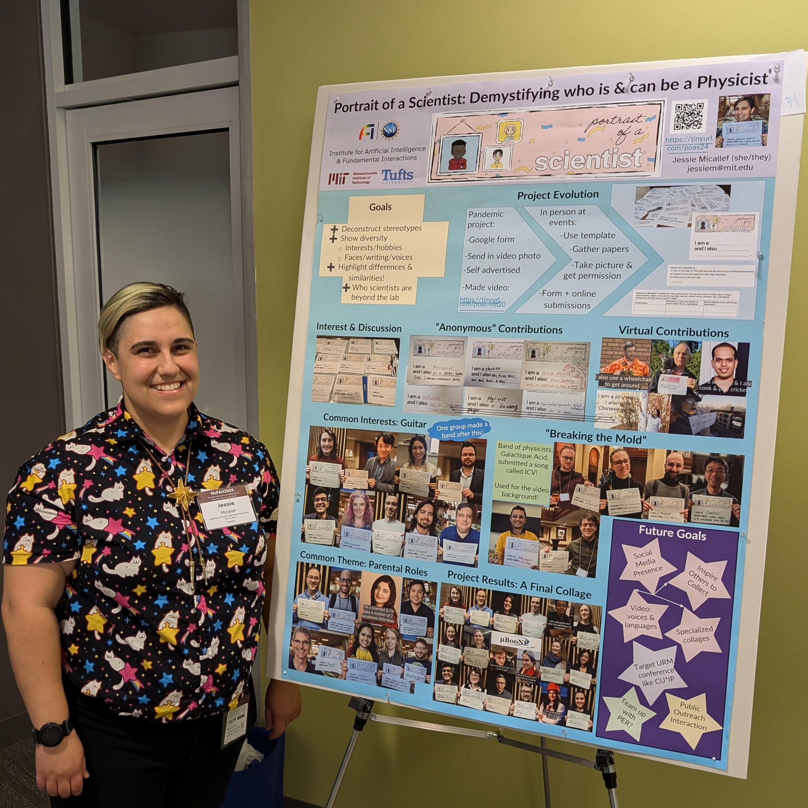
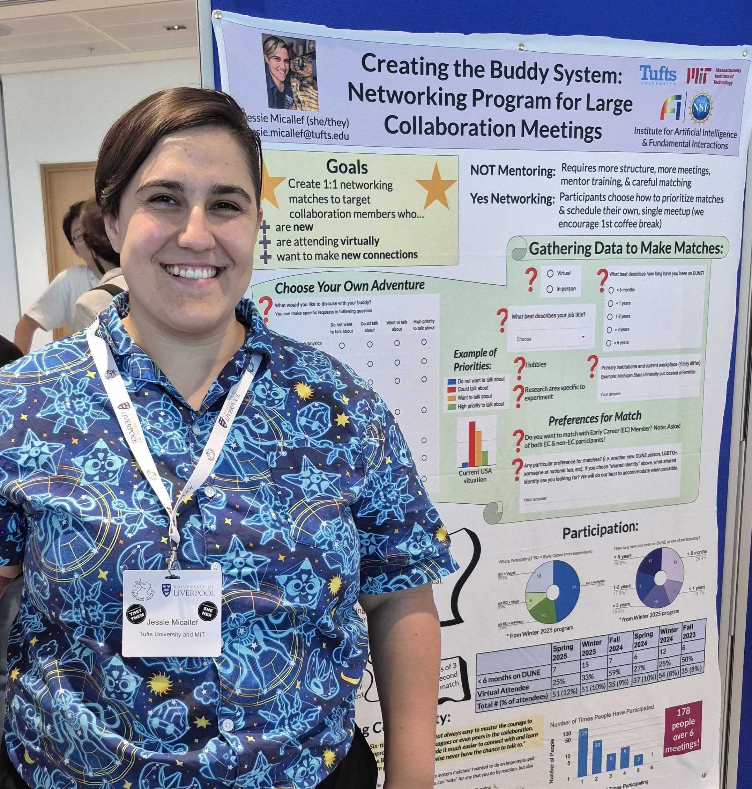
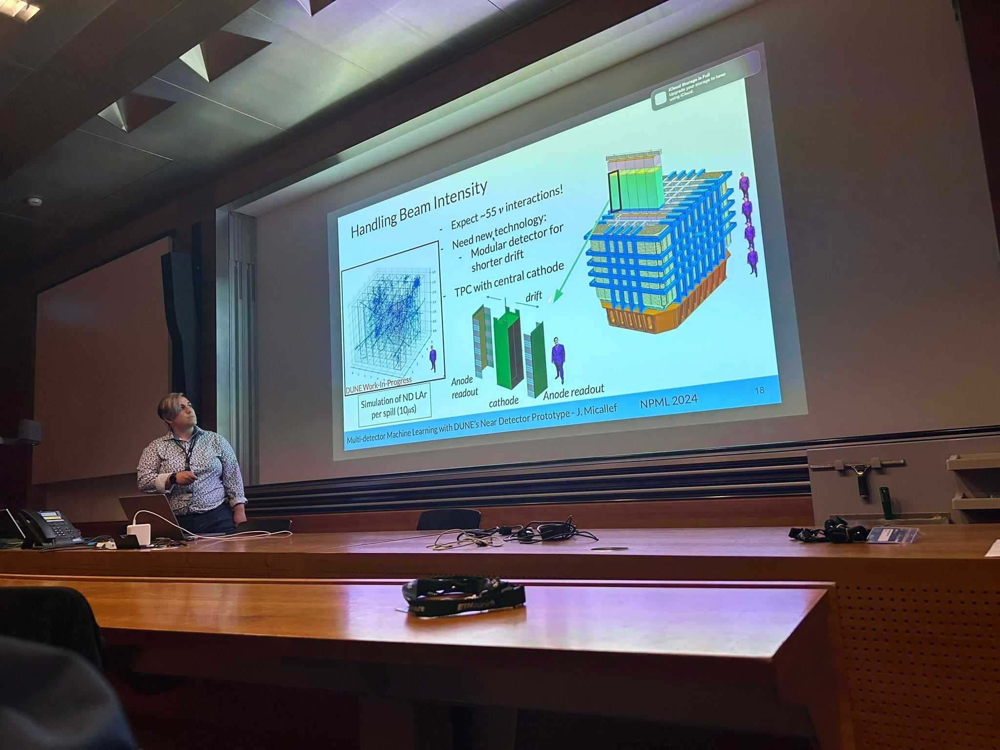

Jessie has been invited to share their research at 2 professional conference plenaries, 2 university colloquium, 8 seminars including CERN, and 2 conference talks. They have given 25 other talks and posters on their work at international conferences and workshops since 2019, with previous experience extending further into their graduate and undergraduate career. They are known for engaging talks with clever graphics, with some examples below. They specialize in making their work accessible for all ages and background, creating presentations for middle school summer camps, public engagement, to professional phsyics and ML conferences.

Catching Neutrinos        |  ML Alphabet Soup          | Open Questions about Neutrinos |
:-------------------------:|:-------------------------:|:-------------------------: |
  |   |   |

## Award Winning Talks & Papers

- Best Poster Award at Neutrino Phyics and Machine Learning: October 2025
- NuFact2025 Best Poster Award (NuFact Confernece): September 2025
- MicroBooNE Collaboration. **Editor's Suggestion** in Phys. Rev. Lett. 135, 081802. August 2025.
- IceCube Collaboration. **Editor's Suggestion** in Phys. Rev. Lett. 134, 091801. March 2025.
- Best Plot for MicroBooNE Analysis Workshop (MicroBooNE Physics Conveeners): November 2022
- Best Lightning Talk (Neutrino Physics and Machine Learning Lightning Talks): July 2020
- William L. Williams Thesis Award	(University of Michigan): Apr 2016
- Best Research Presentation	(Conference for Undergrad Women in Physics, Univeristy of Michigan): Jan 2015
- 1000 Pitches Technology and Hardware Winner (University of Michigan): Dec 2011

## Public Communication Examples 
How we know Neutrinos Oscillate [Fermilab Instagram](https://www.instagram.com/p/C87f37Uxl8G/?hl=en)     |  [Symmetry Magazine](https://www.symmetrymagazine.org/article/machine-learning-and-experiment): Machine learning and experiment         | [MIT Science](https://science.mit.edu/new-perspectives-on-old-questions-ai-meets-particle-physics/) |
:-------------------------:|:-------------------------:|:-------------------------: |
  |   |   |

## Presentations
### Invited
- Seminar at Argonne National Laboratory, February 2026.
- Seminar at CERN International Accelerator, January 2026.
- Colloquium at University of Rochester Physics Department, November 2025.
- Plenary at Pheno2025 Symposium (University of Pittsburgh), May 2025.
- Seminar at University of Wisconsin-Madison Physics Department, Febrauary 2025.
- Colloquium at Notre Dame University Physics Department, Febrauary 2025.
- Seminar at University of Cincinnati: December 2024.
- Plenary talk at IAIFI Workshop (Massachusetts Institute of Technology, MA): August 2024.
- Talk at APS April Meeting (Sacramento, CA): April 2024.
- Seminar at Penn State’s Department of Physics: November 2023.
- Seminar at Harvard’s Lab for Particle Physics and Cosmology: October 2023.
- Seminar at the IAIFI (at Massachusetts Institute of Technology): September 2022.
- Talk at Fermilab’s Fast Inference for Neutrinos group meeting (virtual): October 2021.
- Seminar at Harvard University Lab for Particle Physics and Cosmology (virtual): October 2021.

Jessie Presenting on Portriat of a Scientist        |  Jessie Presenting on Buddy System   |
:-------------------------:|:-------------------------: |
  |   |

### Contributed
- Talks and posters at Neutrino Physics and Machine Learning: June 2026 (University of California-Irvine, USA), October 2025 (University of Tokyo, Japan), June 2024 (ETH Zurich, Switerland),  August 2023 (Tufts University, USA), July 2020 (Virtual).
- Poster at Neutrino International Conference: June 2026 (University of California-Irvine, USA), June 2024 (Milan, Italy), June 2022 (Virtual), June 2020 (Virtual).
- Three talks and poster at NuFact2025 (Univsersity of Liverpool): September 2025.
- Talk and poster at APS Global Summit (Anahiem, CA): March 2025.
- Parallel talk and poster at NuFact Workshop (Argonne National Lab, IL): September 2024.
- Talk at Neutrino Physics and Machine Learning (Virtual, Tufts University, ETH Zurich): July 2020, August 2023, June 2024.
- Talk at the Second WireCell Reconstruction Summit (Brookhaven National Lab): April 2024.
- Parallel talks on MicroBooNE Sterile Searches and IceCube’s neutrino oscillations at International Conference on Topics in Astroparticle and Underground Physics (Vienna, Austria): September 2023.
- Talk at the IAIFI Workshop (at Northeastern University): August 2023.
- Talk at the Tufts Data Intensive Studies Center and Tufts Institute for AI Symposium: April 2023.
- Plenary talk on IceCube’s neutrino oscillations at Lake Louise Winter Institute: February 2023 & 2022.
- Talk at Rising Stars in Experimental Particle Physics Symposium (virtual - U. of Chicago): September 2021.
- Poster at International Cosmic Ray Conference (virtual) with proceedings: July 2021.
- Talk at Very Large Volume Neutrino Telescope Workshop (virtual) with proceedings: May 2021.
- Talks at APS April Meeting (virtual): April 2020, 2021, & 2022.
- Poster at Grace Hopper Celebration (virtual): September 2020.
- Talk at Neutrino Physics and Machine Learning Main Talks (virtual): July 2020.
- Poster at Neutrino2020 and at Neutrino Physics and Machine Learning Lightning Talks (virtual): June 2020.
- Lightning Talk at Women in Data Science Symposium (East Lansing, MI): April 2019.
- 5 posters and 1 talk on undergraduate research (various locations): January 2014 - April 2016.

## Selected Publications

Member of large particle physics collaborations, author lists are alphabetical. Listing publications with direct contribution here, [full list](https://inspirehep.net/authors/1477750) of publications available.

- MicroBooNE Collaboration. Inclusive Search for Anomalous Single-Photon Production in MicroBooNE.  DOI 10.1103/89qs-4lcp. Phys. Rev. Lett. 136, 181806. May 2026.
- MicroBooNE Collaboration. First Search for Dark Sector e+e- Explanations of the MiniBooNE Anomaly at MicroBooNE  DOI 10.1103/3q7x-ks7h. Phys. Rev. Lett. 136, 121804. March 2026.
- IceCube Collaboration. Fast Low Energy Reconstruction using Convolutional Neural Networks. JINST 21 P02020. February 2026.
- MicroBooNE Collaboration. Search for light sterile neutrinos with two neutrino beams at MicroBooNE. **Nature**, volume 648,  pages 64–69. December 2025.
- MicroBooNE Collaboration. Enhanced Search for Neutral Current Δ Radiative Single-Photon Production in MicroBooNE. DOI 10.1103/49ds-5hfh. November 2025.
- MicroBooNE Collaboration. First Search for Neutral Current Coherent Single-Photon Production in MicroBooNE. DOI 2502.06091. February 2025.
- MicroBooNE Collaboration. Search for an Anomalous Production of Charged-Current 𝛎e Interactions without Visible Pions across Multiple Kinematic Observables in MicroBooNE. **Editor's Suggestion** in Phys. Rev. Lett. 135, 081802. August 2025.
- IceCube Collaboration. Measurement of atmospheric neutrino oscillation parameters using convolutional neural networks with 9.3 years of data in IceCube DeepCore. **Editor's Suggestion** in Phys. Rev. Lett. 134, 091801. March 2025.
- J. Micallef for the IceCube Collaboration. Using Convolutional Neural Networks to Reconstruct Energy of GeV Scale IceCube Neutrinos. JINST 16.09 (2021) ,p. C09019.
- J. Micallef for the IceCube Collaboration. Reconstructing Neutrino Energy using CNNs for GeV Scale IceCube Events. PoS ICRC2021(2021) 1057.
- S. Yu for the IceCube Collaboration. Direction Reconstruction using a CNN for GeV-ScaleNeutrinos in IceCube. PoS ICRC2021 (2021) 1054.
- R. Abbasi et al. “A Convolutional Neural Network based Cascade Reconstruction for the IceCube Neutrino Observatory.” In: (Jan. 2021). arXiv:2101.11589
- S. Su, et al incl J. Micallef. The Data Acquisition System of the KOTO Experiment and the RCE Platform technology upgrade. IEEE Transactions on Nuclear Science, PP(99):1–1, 2017.
- S. Su, et al incl J. Micallef. The Data Acquisition System of the KOTO Experiment and RPT Upgrade. In Proceedings, 20th IEEE-NPSS Real Time Conference (RT2016): Padua, Italy, June 5-10, 2016, 2016.
- M. Tecchio, et al incl J. Micallef. The upgrade for the data acquisition system of the KOTO detector. Nucl. Instrum. Meth., A824:365–366, 2016.
- S. Su, et al incl J. Micallef. The data acquisition system for the KOTO detector. PoS, TIPP2014:203, 2014.

Jessie presenting DUNE work at Neutirno Physics and Machine Learning 2024  |
:-------------------------: |
 |
